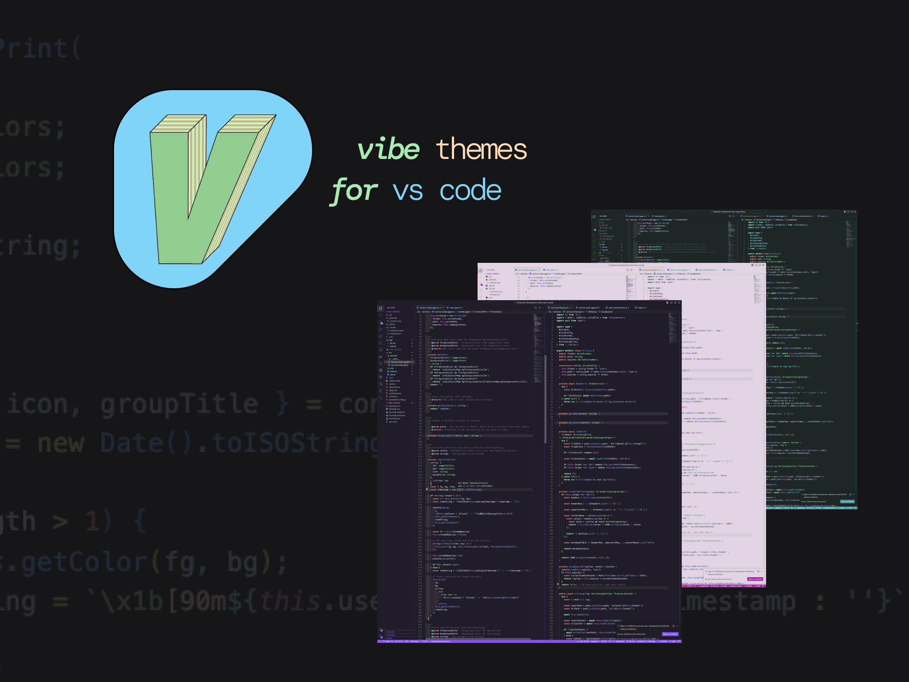
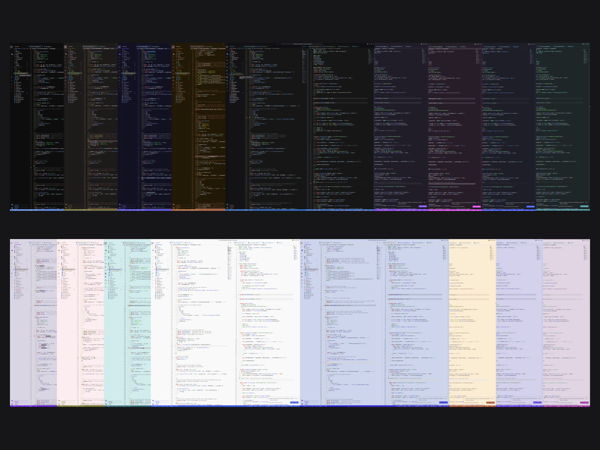

  

    <h1 align="center">
      Vibe  v2.0.1
    </h1>
    

      
    

  

   

## Install

1. Go to [VS Marketplace](https://marketplace.visualstudio.com/items?itemName=yondav.vibe).
2. Click on the "Install" button.
3. Then [select a theme](https://code.visualstudio.com/docs/getstarted/themes#_selecting-the-color-theme).

## Themes

- `Vibe Neutral Dark`
- `Vibe Neutral Light`
- `Vibe Soft Dark`
- `Vibe Soft Light`
- `Vibe Moody Blue Dark`
- `Vibe Moody Blue Light`
- `Vibe Out West Dark`
- `Vibe Out West Light`
- `Vibe Mischka Dark`
- `Vibe Mischka Light`
- `Vibe Prim Dark`
- `Vibe Prim Light`
- `Vibe Hawkes Dark`
- `Vibe Hawkes Light`
- `Vibe Iceberg Dark`
- `Vibe Iceberg Light`

Additionally, the original Vibe Dark theme will remain available under the name `Vibe Dark Legacy`. **Note**: The original theme might not get updated frequently and is now marked as legacy.

## Override this theme

You can follow the guide in the [color theme](https://code.visualstudio.com/api/extension-guides/color-theme) documentation to override any properties in the existing theme configuration.

 

  
    Copyright &copy; 2023 Yoni David
  

